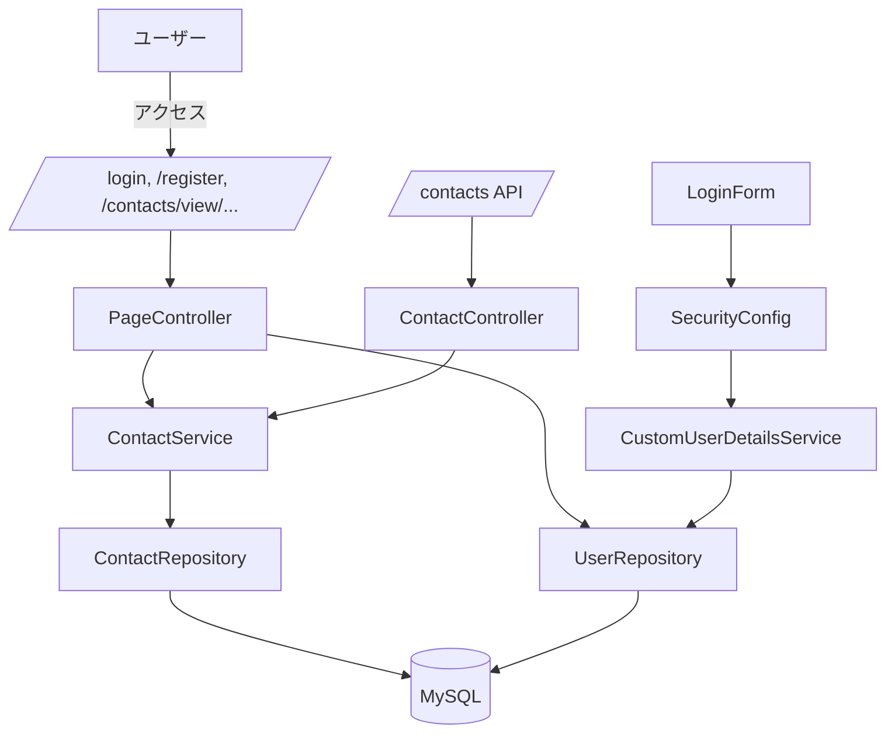
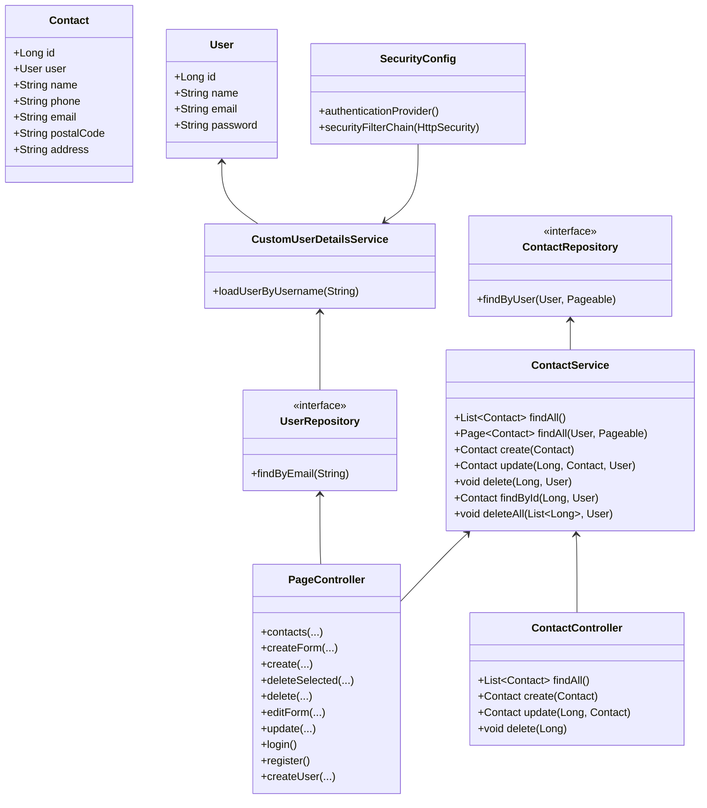

# Java - 住所録 アプリ（crud学習用）

  
   
 
 
   
 
 
 


## プロジェクト概要
このリポジトリは、Java と Spring Boot を使って作成したシンプルな 住所録のサンプルアプリです。  
Docker / Maven などの環境構築や設定は自分で検討し、自作しています。

## 学習・検証目的
- Java + Spring Bootを使ったサーバーサイド開発
- Spring Data JPAを使ったDBアクセス
- REST APIによるCRUD処理
- Thymeleafを使ったサーバーサイドレンダリング
- Spring Securityを使った認証・認可
- Flywayを使ったDBマイグレーション

---

## 主な機能
- Web UI（Thymeleaf）による画面
  - ログイン画面: `src/main/resources/templates/login.html`
  - 新規登録画面: `src/main/resources/templates/register.html`
  - 連絡先一覧画面: `src/main/resources/templates/contacts.html`
  - 連絡先作成画面: `src/main/resources/templates/contact-form.html`
  - 連絡先編集画面: `src/main/resources/templates/contact-edit.html`
  - レイアウト: `src/main/resources/templates/layout.html`
  - これらのページを提供するコントローラ: `src/main/java/com/example/address_book/controller/PageController.java`
- 連絡先（Contact）の CRUD
  - ThymeleafのWeb画面からのCRUD
  - REST API: `GET /contacts`, `POST /contacts`, `PUT /contacts/{id}`, `DELETE /contacts/{id}`（実装: `src/main/java/com/example/address_book/controller/ContactController.java`）
  - サービス層: ページネーション対応 `findAll(User, Pageable)`、作成・更新・削除・一括削除など（`src/main/java/com/example/address_book/service/ContactService.java`）
- バリデーション: `jakarta.validation` アノテーションが `Contact` / `User` に設定されている（`src/main/java/com/example/address_book/Contact.java`, `src/main/java/com/example/address_book/User.java`）
- フロント / サーバ間のフォームエラーハンドリング: `ValidationExceptionHandler`（`src/main/java/com/example/address_book/controller/ValidationExceptionHandler.java`）
- 認証（Spring Security）
  - 設定: `src/main/java/com/example/address_book/config/SecurityConfig.java`

## 使用技術
| カテゴリ | 使用技術 |
| :--- | :--- |
| **language** | Java21 |
| **Framework** | Spring Boot |
| **Authentication / Authorization** | Spring Security |
| **Template Engine** | Thymeleaf |
| **Infrastructure** | Docker Compose ,Maven |
| **OS Environment** | WSL2 (Ubuntu) |
| **Database** | Spring Data JPA, MySQL |
| **Database Migration** | Flyway |


## セットアップ手順

### 1. SpringBootの設定
[Spring Initializr](https://start.spring.io/)
下記の選択肢で設定後、プロジェクトの圧縮フォルダを取得しプロジェクト内へコピー
```
Project: Maven
Language: Java
Spring Boot: 4.1.1
Project Metadata、Group、Artifact、Package nameは任意の内容
Packaging:Jar
Configuration: Properties
Java: 21
Dependencies:
Spring Web Web
Spring Data JPA SQL
MySQL Driver SQL
```
## 2. Mavenの設定
```
sudo chown -R $USER:$USER target
```

### 3. インフラのビルドと起動
```
docker compose up --build
```

### 4. Spring Bootだけ再起動
```
docker compose restart app
```
※コンパイル
```
./mvnw clean compile
```

### 5. Thymeleaf、Flyway追加
pom.xmlに下記追加
```
<dependency>
	<groupId>org.flywaydb</groupId>
	<artifactId>flyway-core</artifactId>
</dependency>
<dependency>
	<groupId>org.flywaydb</groupId>
	<artifactId>flyway-mysql</artifactId>
</dependency>
<dependency>
	<groupId>org.springframework.boot</groupId>
	<artifactId>spring-boot-flyway</artifactId>
</dependency>
```
application.propertiesを変更・追加
```
spring.jpa.hibernate.ddl-auto=validate
spring.flyway.baseline-on-migrate=true
```

### 6. 認証の追加
pom.xmlに下記追加
```
<dependency>
 	<groupId>org.springframework.boot</groupId>
	<artifactId>spring-boot-starter-security</artifactId>
</dependency>
<dependency>
	<groupId>org.springframework.security</groupId>
	<artifactId>spring-security-test</artifactId>
	<scope>test</scope>
</dependency>
```

## ディレクトリ構成（主要ファイル）
ルートから見た主なファイル/フォルダの説明です。

- `pom.xml`
- `Dockerfile`
- `docker-compose.yml`
- `src/main/java/com/example/address_book/`
  - `AddressBookApplication.java`
  - `Contact.java`, `User.java`
  - `config/SecurityConfig.java`
  - `controller/PageController.java`, `controller/ContactController.java`, `controller/ValidationExceptionHandler.java`
  - `repository/ContactRepository.java`, `repository/UserRepository.java`
  - `service/ContactService.java`, `service/CustomUserDetailsService.java`
- `src/main/resources/`
  - `application.properties`
  - `db/migration/` (Flyway SQL)
  - `templates/` (Thymeleaf テンプレート)
---

## 処理の流れ


---

## クラス構成図


---

## 設計・実装の特徴
- MVC 構成: Controller → Service → Repository（JPA）
- エンティティにバリデーションアノテーションが付与されている
- Spring Security によるフォーム認証、`BCryptPasswordEncoder` でパスワードをハッシュ化
- Flyway による DB スキーマ管理
- ページネーションに `Pageable` / `Page` を使用

## 次のステップ（提案）
- Spring Bootの全体構造を前回より解像度高く意識しながら、もう一度アプリを1本作る  

[](https://www.loom.com/share/73a59a41228e443abe83bfb41429603d)

[▶️ 動作デモ動画を視聴する（Loom）](https://www.loom.com/embed/73a59a41228e443abe83bfb41429603d)
