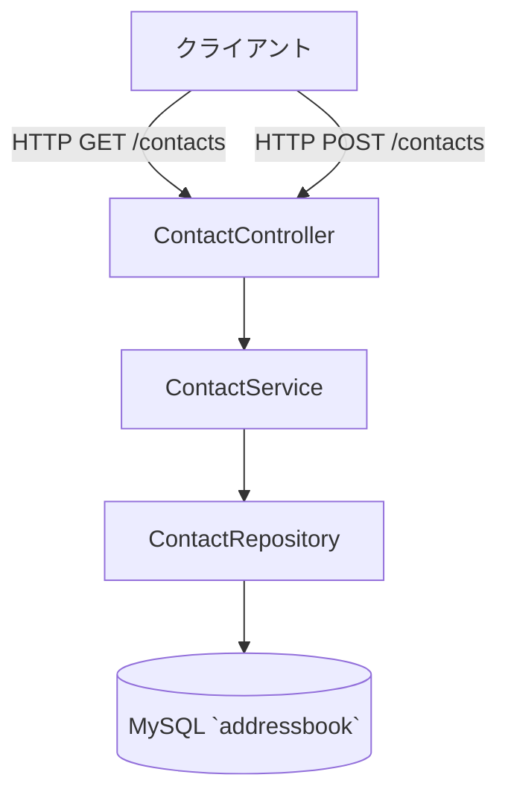
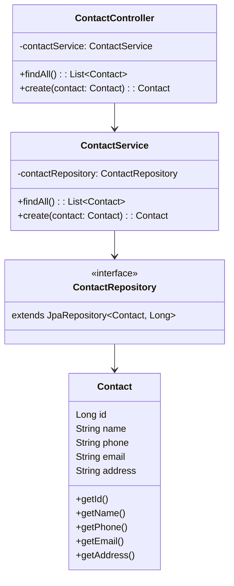

# Java - 住所録 アプリ（crud学習用）

  
 
   
 
 
   

## プロジェクト概要
このリポジトリは、Java と Spring Boot を使って作成したシンプルな 住所録のサンプルアプリです。  
Docker / Maven などの環境構築や設定は自分で検討し、自作しています。

## 学習・検証目的
- Java + Spring Boot を使ったサーバーサイド
- Spring Data JPA を使ったDBアクセス
- REST APIによるCRUD処理
- Thymeleafを使ったサーバーサイドレンダリングの学習

---

## 主な機能
- REST エンドポイント: `GET /contacts` — 連絡先一覧を返す（`src/main/java/com/example/address_book/controller/ContactController.java`）。
- REST エンドポイント: `POST /contacts` — 連絡先を作成する（`ContactController`）。
- JPA エンティティ: `Contact` — フィールド `id, name, phone, email, address` と getter（`src/main/java/com/example/address_book/Contact.java`）。
- 永続化: `ContactRepository` が `JpaRepository<Contact, Long>` を継承している（`src/main/java/com/example/address_book/repository/ContactRepository.java`）。
- サービス層: `ContactService` に `findAll()` と `create(Contact)` が定義されている（`src/main/java/com/example/address_book/service/ContactService.java`）。

## 使用技術
| カテゴリ | 使用技術 |
| :--- | :--- |
| **language** | Java21 |
| **Framework** | Spring Boot |
| **Infrastructure** | Docker Compose ,Maven |
| **OS Environment** | WSL2 (Ubuntu / Alpine Linux) |
| **Database** | Spring Data JPA, MySQL |


## セットアップ手順

### 1. SpringBootの設定
[Spring Initializr](https://start.spring.io/)
下記の選択肢で設定後、プロジェクトの圧縮フォルダを取得しプロジェクト内へコピー
```
Project: Maven
Language: Java
Spring Boot: 4.1.1
Project Metadata、Group、Artifact、Package nameは任意の内容
Packaging:Jar
Configuration: Properties
Java: 21
Dependencies:
Spring Web Web
Spring Data JPA SQL
MySQL Driver SQL
```
## 2. Mavenの設定
```
sudo chown -R $USER:$USER target
```

### 3. インフラのビルドと起動
```
docker-compose up --build
```

### 4. Spring Bootだけ再起動
```
docker compose restart app
```
※コンパイル
```
./mvnw clean compile
```

## ディレクトリ構成（主要ファイル）
ルートから見た主なファイル/フォルダの説明です。

- [pom.xml](pom.xml)
- [Dockerfile](Dockerfile)
- [docker-compose.yml](docker-compose.yml)
- mvnw, mvnw.cmd
- src/
  - main/
    - java/com/example/address_book/
      - AddressBookApplication.java
      - Contact.java
      - controller/ContactController.java
      - repository/ContactRepository.java
      - service/ContactService.java
    - resources/
      - application.properties
  - test/
    - java/com/example/address_book/AddressBookApplicationTests.java
---

## 処理の流れ


---

## クラス構成図


---

## 設計・実装の特徴
- レイヤード構成: コントローラー（HTTP） → サービス（ビジネス） → リポジトリ（DB）というシンプルな分離を採用しています。初心者が役割を理解しやすい構造です。
- JPA を使用した永続化: `Contact` クラスに `@Entity`、`@Id`、`@GeneratedValue` アノテーションが付与されています（`Contact.java`）。
- アプリケーションの DB 設定は `application.properties` にあり、`spring.jpa.hibernate.ddl-auto=update` が設定されています（起動時にスキーマ更新を試みる設定）。
- Docker 環境: `docker-compose.yml` により MySQL とアプリケーション、phpMyAdmin を連携させる設定が確認できます。
- テンプレートエンジン（Thymeleaf）でサーバーサイドにレンダリングした HTML を返します。JavaScript と組み合わせて PWA のサービスワーカーを登録しています。

## 次のステップ（提案）
- バリデーションの実装
- Thymeleafによる画面実装